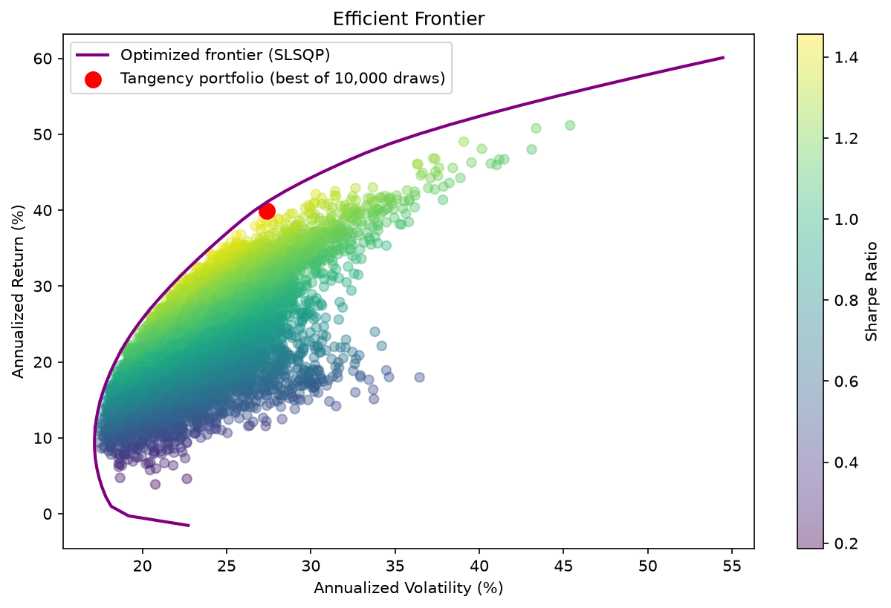
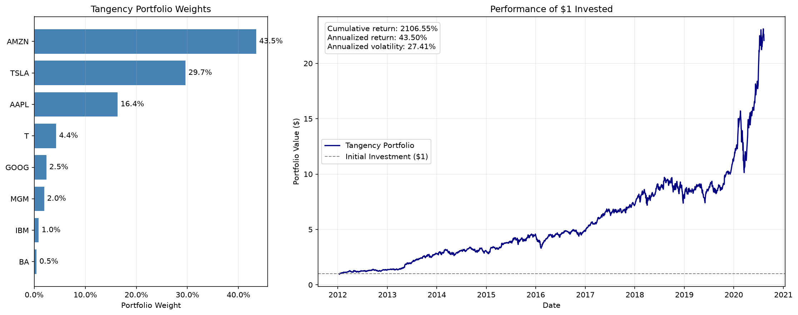
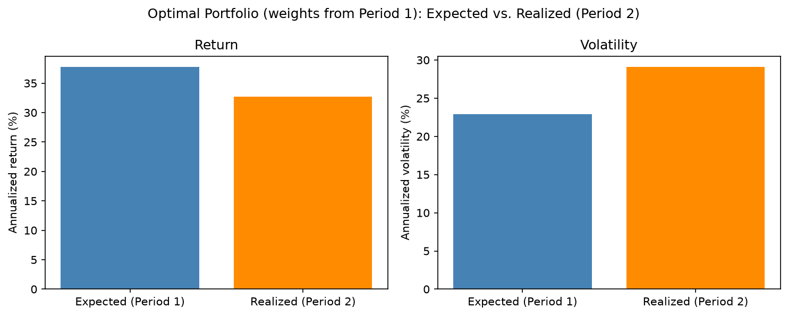
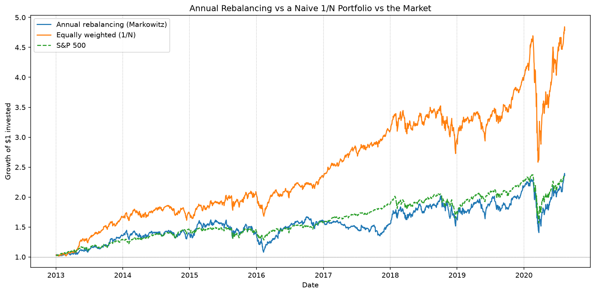
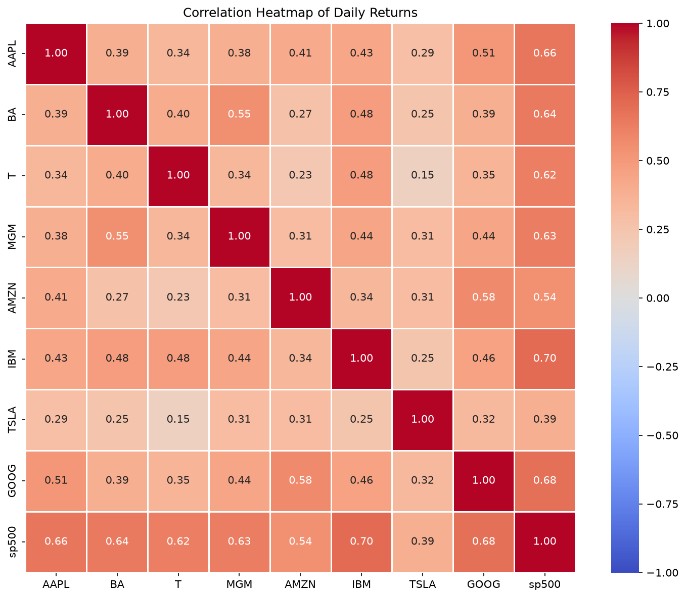

# Does Mean-Variance Optimization Survive Out of Sample? A Markowitz Test on US Equities

A Python study of Markowitz portfolio optimization on eight large US stocks (2012–2020). It builds the efficient frontier and the maximum-Sharpe (tangency) portfolio, then asks the question a portfolio manager actually faces: **do weights chosen on past data deliver the promised risk-adjusted return in the future?** It answers with a train/test split and an annually re-optimized strategy benchmarked against the S&P 500 and a naive equally weighted (1/N) portfolio.

> **Status:** completed team project (4 authors), originally developed as coursework in an MSc finance course at Bocconi University. See [Authors](#authors-and-contributions) and [Disclaimer](#disclaimer).
>
> **Companion project:** [Testing the CAPM on US Equities](https://github.com/ceciliaalocicero/capm-empirical-tests-sp500), which uses the same eight stocks to study beta and asset pricing.

---

## Research question

A fund manager can choose among eight stocks with no transaction fees. Which long-only weights maximize the Sharpe ratio, and how much of that in-sample performance survives when the weights must be chosen before the returns are known?

## Key findings

| # | Finding | Evidence |
|---|---------|----------|
| 1 | **In hindsight, the optimizer concentrates in a few winners.** The full-sample tangency portfolio puts 90% in AMZN (43.5%), TSLA (29.7%) and AAPL (16.4%), with an annualized return of 39.9%, volatility of 27.4% and Sharpe ratio of 1.46. $1 grows to about $22 over 2012–2020. This is an **in-sample** result: the weights were chosen knowing the outcomes. | 10,000 random long-only portfolios; risk-free rate = 0 |
| 2 | **Out of sample, risk-adjusted performance drops by about a third.** Weights estimated on 2012–2015 promised a 37.7% return at 22.9% volatility (Sharpe 1.65). Applied to 2016–2020 they delivered 32.7% at 29.1% volatility (Sharpe 1.12). | Train 2012–2015, test 2016–Aug 2020 |
| 3 | **Optimal weights are unstable.** Re-optimizing on 2016–2020 alone changes the allocation sharply: BA falls from 25.2% to 1.4%, while AMZN rises from 37.4% to 62.4%. | Period-by-period tangency weights |
| 4 | **Annual re-optimization on one year of data underperforms naive 1/N.** Sharpe 0.59 for the re-optimized strategy, vs. 0.74 for the S&P 500 and 1.04 for equal weights. $1 grows to 2.36, 2.34 and 4.79 respectively. The optimizer put 33–77% of the portfolio in a single stock each year, and the top holding kept changing. | 8 annual re-optimizations, 2013–2020 |
| 5 | **Diversification potential is real but uneven.** Correlation with the S&P 500 ranges from 0.39 (TSLA) to 0.70 (IBM); AMZN–BA is only 0.27, while MGM–BA is 0.55 (shared cyclical exposure). All return distributions are fat-tailed. | Daily-return correlations and histograms |

**Bottom line:** mean-variance optimization is only as good as its inputs. With noisy estimates of expected returns, the "optimal" portfolio is concentrated, unstable and overconfident, which is consistent with the estimation-error literature (e.g. DeMiguel, Garlappi and Uppal, 2009).

---

## Selected results

**Simulated portfolios and the optimized efficient frontier (full sample)**



**Tangency portfolio: weights and growth of $1 (in-sample)**



**Expected (2012–2015) vs. realized (2016–2020) return and volatility**



**Annual re-optimization vs. equal weights vs. the S&P 500**



**Correlation of daily returns**



All 11 figures are in [`figures/`](figures/). The notebook also contains an interactive Plotly histogram, which GitHub does not render; open the notebook in [nbviewer](https://nbviewer.org/github/ceciliaalocicero/markowitz-portfolio-optimization-backtest/blob/main/notebooks/markowitz_portfolio_optimization.ipynb) to see it.

---

## Data

| Dataset | Content | Period | Included in repo? |
|---------|---------|--------|-------------------|
| Eight-stock price file | Daily closing prices of AAPL, BA, T, MGM, AMZN, IBM, TSLA, GOOG and the S&P 500 price index (2,159 trading days) | 12 Jan 2012 – 11 Aug 2020 | **No** (course-provided file) |

Prices are split-adjusted but not dividend-adjusted, so returns are price returns. The data cannot be redistributed; the notebook is committed **with its outputs**, so all results are readable on GitHub. See [`data/README.md`](data/README.md) to rebuild an equivalent file from public data.

---

## Methodology

**Returns.** Simple daily returns in percent, computed with an explicit loop over stocks and dates (as required by the original brief). Annualization: mean × 252, covariance × 252. Risk-free rate = 0, so the Sharpe ratio is return divided by volatility.

**Descriptive analysis.** Price levels and dispersion, normalized prices (growth of $1), daily-return series, correlation matrix, and return histograms.

**Efficient frontier.**
- *Simulation:* 10,000 long-only portfolios with weights drawn from a flat Dirichlet distribution (fixed seed for reproducibility); the maximum-Sharpe draw approximates the tangency portfolio.
- *Optimization:* for 50 target returns, SciPy SLSQP minimizes portfolio variance subject to full investment, the target return, and 0 ≤ wᵢ ≤ 1 (no short selling).

**Out-of-sample test.** Tangency weights estimated on 2012–2015 are held fixed and evaluated on 2016–Aug 2020: expected (in-sample) vs. realized return, volatility and Sharpe ratio.

**Annual re-optimization.** Each year, tangency weights are estimated on the previous calendar year only and applied to the next (2013–2020), compared with an equally weighted portfolio and the S&P 500 over the same days.

---

## Repository structure

```
markowitz-portfolio-optimization-backtest/
├── README.md
├── LICENSE
├── requirements.txt
├── .gitignore
├── notebooks/
│   └── markowitz_portfolio_optimization.ipynb   # full analysis, committed with outputs
├── figures/                                     # 11 PNG charts exported from the notebook
├── data/
│   └── README.md                                # how to obtain the data (no data committed)
└── references/
    └── README.md
```

## Technologies

Python · pandas · NumPy · SciPy (SLSQP optimization) · Matplotlib · seaborn · Plotly · Jupyter

## Reproducing the analysis

```bash
git clone https://github.com/ceciliaalocicero/markowitz-portfolio-optimization-backtest.git
cd markowitz-portfolio-optimization-backtest
python -m venv .venv
.venv\Scripts\activate          # macOS/Linux: source .venv/bin/activate
pip install -r requirements.txt
```

1. Obtain the price file as described in [`data/README.md`](data/README.md) and save it as `data/raw/Data_PCLab1_Stock.csv`.
2. Run `jupyter lab`, open `notebooks/markowitz_portfolio_optimization.ipynb`, and select *Run → Run All Cells*.

Random portfolios use a fixed seed, so results are reproducible with the original file. A file rebuilt from another source will give slightly different numbers.

## Limitations

- **Hindsight in stock selection.** The eight stocks are well-known names that include large ex-post winners (AMZN, TSLA, AAPL). Any strategy on this universe, including 1/N, benefits from that selection, so beating the S&P 500 here says little about skill.
- **Approximate tangency portfolio.** It is the best of 10,000 random draws, so it sits slightly inside the optimized frontier rather than exactly on it.
- **Short estimation windows.** Four years in the train/test split and one year in the annual strategy make expected-return estimates very noisy.
- **No frictions or constraints.** No transaction costs, taxes or turnover limits, no risk-free asset (rf = 0), and no concentration, sector or liquidity limits that a regulated fund would face.
- **Price returns only** (no dividends); 2020 is a partial year that includes the COVID crash.
- **Return conventions.** Most statistics use arithmetic annualization (mean × 252); the growth-of-$1 charts compound daily returns, so their annualized figures differ.
- **First-day return.** The first day's return is set to 0 rather than dropped. This adds one zero observation out of 2,159 and has a negligible effect on the results.

## Authors and contributions

Team project by **Cecilia Lo Cicero, Sara Pulidori, Alissa Sharuda and Nico Visentin**.

Repository prepared and maintained by **Cecilia Lo Cicero**. *My contributions: I contributed to every part of the project, from data preparation and descriptive analysis to the efficient frontier, the out-of-sample test, the annual re-optimization and the write-up.*

Developed as coursework for *Finance with Big Data* (MSc, Bocconi University). The assignment framework was provided by the course; the analysis, extensions and write-up are the team's own.

## References

- DeMiguel, V., Garlappi, L., & Uppal, R. (2009). Optimal versus naive diversification: How inefficient is the 1/N portfolio strategy? *Review of Financial Studies*, 22(5), 1915–1953.
- Markowitz, H. (1952). Portfolio selection. *Journal of Finance*, 7(1), 77–91.
- Michaud, R. O. (1989). The Markowitz optimization enigma: Is "optimized" optimal? *Financial Analysts Journal*, 45(1), 31–42.
- Sharpe, W. F. (1966). Mutual fund performance. *Journal of Business*, 39(1), 119–138.
- Tobin, J. (1958). Liquidity preference as behavior towards risk. *Review of Economic Studies*, 25(2), 65–86.

## Disclaimer

This is an educational project. It does not constitute investment advice or a recommendation to buy or sell any security. All results are historical; past performance does not predict future returns. The data are not distributed because they were provided for coursework.

## License

Code is released under the [MIT License](LICENSE). Data are not included.
